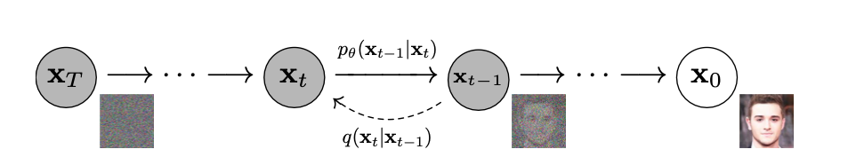

# Layered Rendering Diffusion Model
Unofficial implementation of the paper "Layered Rendering Diffusion Model for Zero-Shot Guided Image Synthesis". 

You can find the implementation in this [Colab notebook](https://drive.google.com/file/d/1KcNvrjh7k5G4FFbzeMfdGruA-o0Y4XZB/view?usp=share_link), modifying the [Stable Diffusion model](https://huggingface.co/stabilityai/stable-diffusion) from Hugging Face.

## Objective of the Model
Control the layout of the images generated from the diffusion model, **_without retraining or fine-tuning_**, and achieve better semantic alignment.

## Evaluation Matrix
CLIP score and T2I-Sim: text image sementic alignment
IOU: layout overlay
AP: generate right class

## Evaluation Dataset
1134 captions with objects, with bonding box or masks.

## Diffusion Model
The diffusion model consists of two distinct processes: **forward** and **reverse (generation)**. Understanding the diffusion process from a physical perspective reveals that the forward process mimics the diffusion of pollen particles in water. During this phase, the diffusion model consistently introduces random noise into the system.

In contrast, the **reverse (generation)** process is designed to entirely reverse the diffusion process, allowing for the collection of pollen. This reversal entails retracing the movements or distribution of diffusing particles in the opposite direction, ultimately restoring the initial configuration.

<figure>
  
  <figcaption>Figure 1. The directed graphical model of DDPM (Ho et al., 2020). </figcaption>
</figure>

## Latent Diffuse Model
The **latent diffusion model** can further reduce the time of the forward and reverse processes by performing the diffusion in the latent space without reducing synthesis quality (Rombach et al., 2022). The architecture of the latent diffusion model is shown in Figure 2. The latent diffusion model includes two stages: 
1. The first stage contains a **VAE** (Razavi et al., 2019) or **VQGAN** (Esser et al., 2021) model. The encoder $`\varepsilon`$ encodes $`x`$ into the latent space $`z`$, and the decoder $`D`$ decodes $`z`$ into the image space.
2. In the second stage, forward and reverse diffusion happens in the latent space $`z`$, thus reducing the training and inference time.
The conditions are added to the diffusion model after being embedded using the encoder $`\tau_{\theta}`$. The encoded conditions are queried in the cross-attention layers of the modified U-Net $`\epsilon_{\theta}`$ model.

<figure>
  
  <figcaption>Figure 2. The architecture of latent diffuse model (Rombach et al.,2022) </figcaption>
</figure>

## Layered Rendering Diffusion Model
<figure>
  
</figure>
The algorithm of layer rendering model is shown below:
<figure>
  
</figure>

## Unoffical Implementation
Since the paper did not publish the implementation, I have implemented the approach described in the paper without strictly following the algorithm due to some confusion in the model description. Therefore, this implementation takes the essence of the algorithm, which adds vision guidance to the noise image in the latent space. The current implementation follows the steps below:

1. Modify only the "up_attention" module in the U-Net, selecting the attention map with the top-k intensities. Then, go through a single sampling step and generate the vision guidance by weighting the layout with the attention map.
2. The weighted mask is then added to the random noise for image generation.
3. The following algorithm exactly follows the algorithm shown above.

## Result of this Implementation
This is the image generated in the <a href="https://drive.google.com/file/d/1KcNvrjh7k5G4FFbzeMfdGruA-o0Y4XZB/view?usp=share_link">layer rendering diffusion model colab </a>
<figure>
  
</figure>

